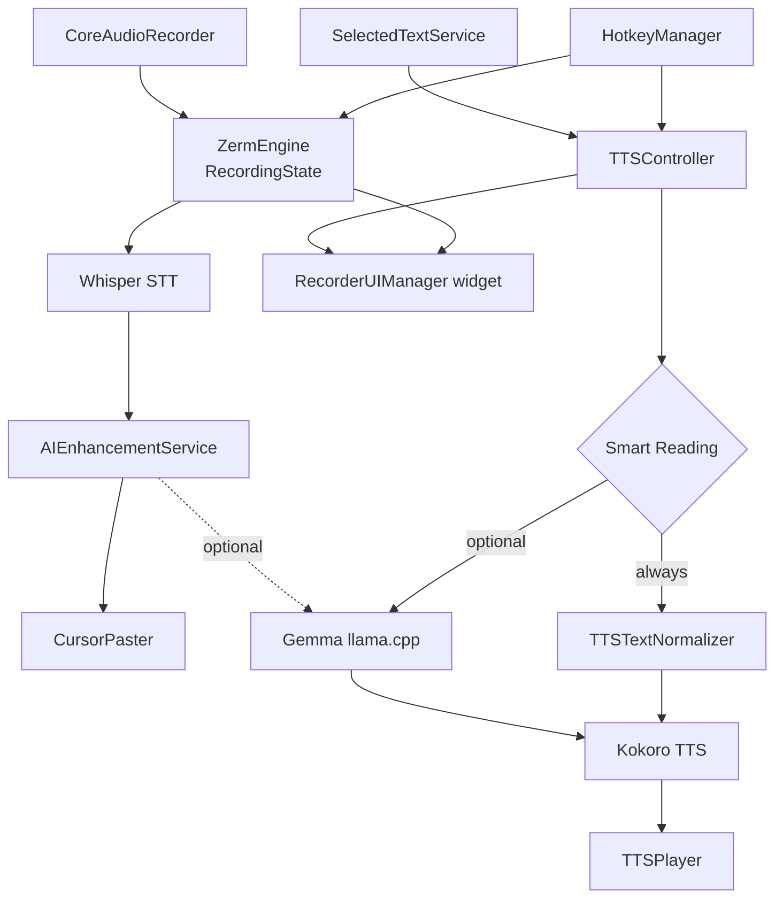
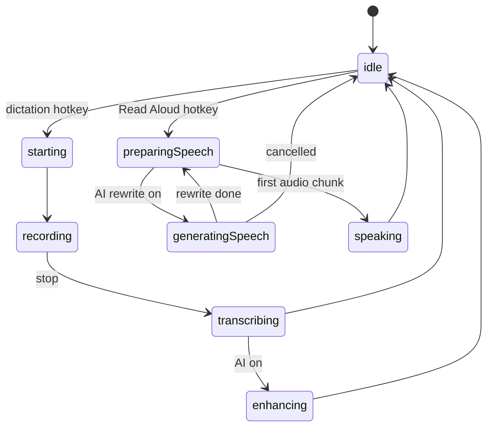

# Zerm Architecture

## System Overview

Two flows share one engine, one state machine, and one recorder widget — and are mutually exclusive.

See [[Zerm Three Model Platform]], [[Zerm Read Aloud]], [[Zerm Smart Reading]], [[Zerm On-Device LLM]].

## Tech Stack

- **Language:** Swift 5.10+
- **UI:** SwiftUI + AppKit (NSPanel for recording overlays)
- **Data:** SwiftData (transcription history, vocabulary, word replacements)
- **Audio:** CoreAudio AUHAL (`CoreAudioRecorder.swift`) for capture, AVFoundation/AVAudioEngine for playback
- **On-device AI (three models):** `whisper.cpp` (STT), `sherpa-onnx` + Kokoro (TTS), `llama.cpp` + Gemma (LLM) — all prebuilt XCFrameworks under `$(HOME)/Zerm-Dependencies/`
- **Packaging:** Xcode + xcodebuild, ad-hoc signed for local dev
- **Updates:** Sparkle 2.x (`UpdaterViewModel`)
- **Dependencies (Swift packages):** KeyboardShortcuts 2.4.x, LaunchAtLogin-Modern, Sparkle, FluidAudio, LLMkit, swift-atomics, Zip, AXSwift, SelectedTextKit, KeySender, MediaRemoteAdapter

## Key Singletons / Shared State

| Class | Role |
|-------|------|
| `ZermEngine` | Recording + pipeline orchestration (`@MainActor`) |
| `RecorderUIManager` | Mini/notch recorder panel lifecycle |
| `HotkeyManager` | NSEvent modifier monitors + KeyboardShortcuts |
| `WhisperModelManager` | Whisper context lifecycle + download |
| `TranscriptionModelManager` | Active model selection |
| `PowerModeSessionManager` | Save/restore AI settings per app context |
| `AudioDeviceManager` | CoreAudio device enumeration (`@MainActor`) |
| `MediaController` | System audio mute/unmute |
| `NotificationManager` | Floating notification banner |
| `WordReplacementService` | Post-transcription text substitution |
| `AIEnhancementService` | LLM enhancement pipeline |
| `ModelPrewarmService` | Pre-run model on app launch + wake |

## Recording State Machine

`RecordingState` (on `ZermEngine`) is the single source of truth; the hotkey is ignored unless the state allows it (`canProcessHotkeyAction`). Dictation and Read Aloud both start only from `.idle`, so they are mutually exclusive.

The widget label is driven directly by the state: **Transcribing / Enhancing** (dictation), **Thinking… / Preparing… / live bars** (Read Aloud).

## Whisper Model Loading

Models are stored at `~/Library/Application Support/com.arcusis.zerm/WhisperModels/`.  
Loading is done in a `Task.detached` with `DispatchQueue.global` for the blocking C call.  
Flash attention enabled by default; falls back without flash attention for q5_0/q8_0 quantized models.  
`runPipeline` waits for `isModelLoading == false` before processing, preventing the idle-first-transcription failure.

## Window Management

- Main window: `WindowManager.shared` — stored with identifier `com.arcusis.zerm.mainWindow`, autosaved as `ZermMainWindowFrame`
- Mini recorder: `MiniRecorderPanel` (NSPanel, `.canJoinAllSpaces`, `.floating` level)
- Notch recorder: `NotchRecorderPanel` (NSPanel, `.canJoinAllSpaces`, `.stationary`)
- Settings/navigation from menu bar: `MenuBarManager.openMainWindowAndNavigate` — must call `NSApp.unhide(nil)` before `makeKeyAndOrderFront` when coming from `.accessory` activation policy

## Paste Pipeline

See [[Zerm Auto Paste]].  
`CursorPaster` uses CGEvent Cmd+V by default.  
AppleScript paste (off by default, via `useAppleScriptPaste` UserDefault) now runs on `DispatchQueue.global` to avoid macOS 26 `dispatch_assert_queue_fail`.

## Power Mode

Power Mode detects the frontmost app and (for browsers) the active tab URL.  
Browser URL detection uses inline AppleScript generated in `BrowserURLService.inlineURLScript(for:pid:)` targeting the frontmost regular-policy browser instance — not the display-name `tell application` form which breaks with multiple browser processes.

Related: [[Zerm Overview]]
