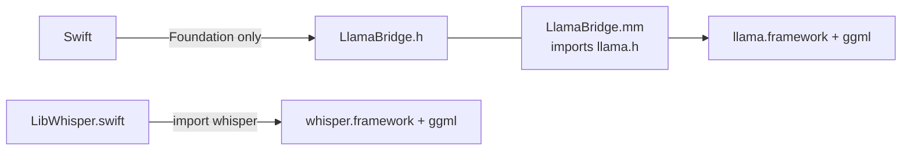

# Zerm On-Device LLM

The third local model — Gemma via `llama.cpp` — powers smart reading and AI enhancement. Code in `Zerm/LocalLLM/`.

**Default:** Gemma 4 E2B Instruct Q4_K_M GGUF (~3.1 GB) from `unsloth/gemma-4-E2B-it-GGUF`. E2B is the smallest Gemma 4 (PLE, effective ~2B). Model-agnostic — uses each GGUF's built-in chat template (Gemma fallback), so other instruct models can be swapped in.

## Components

- `LocalLLMModelManager.swift` — singleton downloader/loader (mirrors `KokoroModelManager`).
- `LlamaEngine.swift` — `actor` serializing inference off-main.
- `LlamaBridge.h` / `.mm` — Objective-C++ wrapper around `llama.cpp`.

## The ggml isolation problem (critical)

`whisper.cpp` and `llama.cpp` both vendor **`ggml`** at different versions; both export it as a Clang module. Importing both into Swift = conflicting `ggml_op`/`ggml_type` definitions → build error.

**Fix:** confine `#import <llama/llama.h>` to `LlamaBridge.mm` (one Obj-C++ TU). Swift only sees the Foundation-only `LlamaBridge` and never imports the `llama` module, so the two ggml versions are never co-imported.

## Inference (llama.cpp b9699)

`llama_model_load_from_file` → `llama_init_from_model` (`n_gpu_layers=999`, Metal). Prompt via `llama_chat_apply_template`. Decode loop: `llama_batch_get_one` → `llama_decode` → `llama_sampler_sample(-1)`, stop on `llama_vocab_is_eog`. Sampler: top-k 40 / top-p 0.95 / **temp 0.3** / dist. KV reset: `llama_memory_clear(llama_get_memory(ctx), true)`.

### Runtime gotchas (fixed)

- **Metal exit crash** (`ggml_metal_rsets_free` abort at process exit): set `GGML_METAL_NO_RESIDENCY=1` before `llama_backend_init()`.
- **`<end_of_turn>` spoken**: small models emit it as literal text — stop generation at the delimiter; strip stray control tokens.

## Packaging

`llama.xcframework` (b9699) — dynamic, module map, **embedded + signed** (mirrors whisper). No bridging header for the framework; `.mm` includes it directly.

## Consumers

- Read Aloud naturalization (`TTSNaturalizer`) — see [[Zerm Smart Reading]].
- AI enhancement (`AIProvider.localLLM`, recommended default, no key).

Both share one `LocalLLMModelManager` / one loaded model.

Related: [[Zerm Smart Reading]], [[Zerm Read Aloud]], [[Zerm Architecture]]
