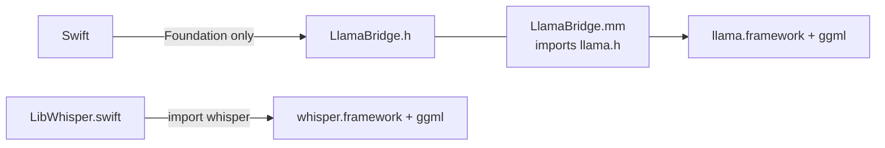

# Zerm On-Device LLM

The third local model — Gemma via `llama.cpp` — powers smart reading and AI enhancement. Code in `Zerm/LocalLLM/`.

**Default:** Google's official Gemma 4 E2B Instruct QAT Q4_0 GGUF (~3.35 GB), pinned to Hugging Face revision `675cff42` and verified with SHA-256 before installation. E2B is the smallest Gemma 4 (PLE, effective ~2B) and is deliberately the default on every Apple-silicon memory tier. E4B, 12B, and 27B remain manual opt-ins; installed RAM never silently selects a larger model. The previous Unsloth E2B Q4_K_M remains catalogued for compatibility with existing downloads.

The runtime uses a 4K context on sub-12 GB systems and an 8K context elsewhere. It does not allocate 16K/32K caches for Zerm's focused rewriting and narration jobs. A warm model is released after two idle minutes, while memory-pressure handling can reclaim it immediately. This keeps burst performance without permanently reserving several gigabytes of unified memory.

## Components

- `LocalLLMModelManager.swift` — singleton downloader/loader (mirrors `KokoroModelManager`).
- `LlamaEngine.swift` — `actor` serializing inference off-main.
- `LlamaBridge.h` / `.mm` — Objective-C++ wrapper around `llama.cpp`.

## The ggml isolation problem (critical)

`whisper.cpp` and `llama.cpp` both vendor **`ggml`** at different versions; both export it as a Clang module. Importing both into Swift = conflicting `ggml_op`/`ggml_type` definitions → build error.

**Fix:** confine `#import <llama/llama.h>` to `LlamaBridge.mm` (one Obj-C++ TU). Swift only sees the Foundation-only `LlamaBridge` and never imports the `llama` module, so the two ggml versions are never co-imported.

```mermaid
flowchart LR
    SW[Swift] -->|Foundation only| BR[LlamaBridge.h]
    BR --- MM[LlamaBridge.mm<br/>imports llama.h]
    MM --> LL[llama.framework + ggml]
    LWS[LibWhisper.swift] -->|import whisper| WF[whisper.framework + ggml]
```

## Inference (llama.cpp commit `dd69db2`)

`llama_model_load_from_file` → `llama_init_from_model` (`n_gpu_layers=999`, Metal). Prompt via `llama_chat_apply_template`. Decode loop: `llama_batch_get_one` → `llama_decode` → `llama_sampler_sample(-1)`, stop on `llama_vocab_is_eog`. Sampler: top-k 40 / top-p 0.95 / **temp 0.3** / dist. KV reset: `llama_memory_clear(llama_get_memory(ctx), true)`.

### Runtime gotchas (fixed)

- **Metal exit crash** (`ggml_metal_rsets_free` abort at process exit): set `GGML_METAL_NO_RESIDENCY=1` before `llama_backend_init()`.
- **`<end_of_turn>` spoken**: small models emit it as literal text — stop generation at the delimiter; strip stray control tokens.

## Packaging

`llama.xcframework` (source pinned by `LLAMA_COMMIT` in the Makefile) — dynamic, module map, **embedded + signed** (mirrors whisper). Metal and Accelerate are enabled by the upstream Apple build; the bridge requests full Metal offload and falls back only when the runtime cannot provide it. No bridging header for the framework; `.mm` includes it directly.

## Consumers

- Read Aloud naturalization (`TTSNaturalizer`) — see [[Zerm Smart Reading]].
- AI enhancement (`AIProvider.localLLM`, recommended default, no key).

Both share one `LocalLLMModelManager` / one loaded model.

Related: [[Zerm Smart Reading]], [[Zerm Read Aloud]], [[Zerm Architecture]]
