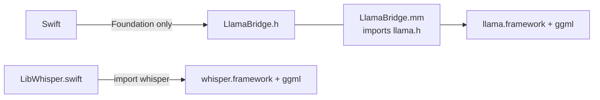

# Zerm On-Device LLM

The third local model — Gemma via `llama.cpp` — powers smart reading and AI enhancement. Code in `Zerm/LocalLLM/`.

**Three jobs, two catalogs.** Dictation is Whisper (already instant). Enhancement and Read Aloud both default to **Gemma 4 E2B** (`gemma-4-E2B_q4_0-it.gguf`, ~3.35 GB, Google QAT q4_0). Qwen3 4B Instruct 2507 is the smaller enhancement opt-in.

The 2.8.3 choice of Qwen3 1.7B was reversed on measurement, not taste. 24 models were benchmarked against the shipped prompt over a 20-case dictation set and a 22-case EN/RU/HE set, three runs each, through the real `llama.cpp` bridge:

| model | size | quality | mixed-script (EN/RU/HE) |
|---|---|---|---|
| **Gemma 4 E2B** | 3.35 GB | 13/20 | **22/22** |
| Gemma 4 E4B qat | 5.15 GB | 15–17/20 | unstable (2/2, 1/2, 1/2) |
| Qwen3 4B Instruct | 2.50 GB | 14/20 | 0/2 |
| Granite 3.3 2B | 1.55 GB | 12/20 | 1/2 |
| Qwen2.5 1.5B | 0.92 GB | 8/20 | 0/2 |
| Gemma 3 1B | 0.81 GB | 5–7/20 | 14/22 |
| ~~Qwen3 1.7B~~ | 1.11 GB | 6/20 | 0/2 |

**Gemma 4 E2B is the only model measured that keeps mixed Hebrew/English/Russian in its original script.** Everything smaller translates it, and two 4B models also fabricated — Qwen3 turned Monday into "Tuesday", Llama 3.2 into "Sunday". `EnhancementLanguageGuard` rejects a translated rewrite, so a smaller model does not paste wrong text; it produces *no enhancement at all* on those lines.

Retired on measurement, and deleted from disk by `RetiredLocalLLMMigration`: Qwen3 1.7B (6/20, prompt scaffolding echoed in 19 of 20 cases, 0/4 spoken self-corrections), Qwen3 0.6B (3/20, 3 empty), Qwen3 4B, and the legacy `gemma-4-E2B-it-Q4_K_M` quant (9 of 20 produced nothing). Also rejected: Phi-4 Mini (0/2 script under the shipped prompt), Aya Expanse 8B (8/20), LFM2 1.2B (18/20 scaffolding leaks).

`disablesThinking` is an explicit per-package flag, never inferred from the file name: Qwen3-4B-Instruct-2507 is a Qwen3 build with no `enable_thinking` in its template.

The runtime uses a 4K context on sub-12 GB systems and an 8K context elsewhere. It does not allocate 16K/32K caches for Zerm's focused rewriting and narration jobs. A warm model is released after two idle minutes, while memory-pressure handling can reclaim it immediately. This keeps burst performance without permanently reserving several gigabytes of unified memory.

## Components

- `LocalLLMModelManager.swift` — singleton downloader/loader (mirrors `KokoroModelManager`).
- `LlamaEngine.swift` — `actor` serializing inference off-main.
- `LlamaBridge.h` / `.mm` — Objective-C++ wrapper around `llama.cpp`.

## The ggml isolation problem (critical)

`whisper.cpp` and `llama.cpp` both vendor **`ggml`** at different versions; both export it as a Clang module. Importing both into Swift = conflicting `ggml_op`/`ggml_type` definitions → build error.

**Fix:** confine `#import <llama/llama.h>` to `LlamaBridge.mm` (one Obj-C++ TU). Swift only sees the Foundation-only `LlamaBridge` and never imports the `llama` module, so the two ggml versions are never co-imported.

```mermaid
flowchart LR
    SW[Swift] -->|Foundation only| BR[LlamaBridge.h]
    BR --- MM[LlamaBridge.mm<br/>imports llama.h]
    MM --> LL[llama.framework + ggml]
    LWS[LibWhisper.swift] -->|import whisper| WF[whisper.framework + ggml]
```

## Inference (llama.cpp commit `dd69db2`)

`llama_model_load_from_file` → `llama_init_from_model` (`n_gpu_layers=999`, Metal). Prompt via `llama_chat_apply_template`. Decode loop: `llama_batch_get_one` → `llama_decode` → `llama_sampler_sample(-1)`, stop on `llama_vocab_is_eog`. Sampler: top-k 40 / top-p 0.95 / **temp 0.3** / dist. KV is *not* cleared per request — see prompt prefix caching below.

### Runtime gotchas (fixed)

- **Metal exit crash** (`ggml_metal_rsets_free` abort at process exit): set `GGML_METAL_NO_RESIDENCY=1` before `llama_backend_init()`.
- **`<end_of_turn>` spoken**: small models emit it as literal text — stop generation at the delimiter; strip stray control tokens.
- **`<think>` must never be a stop delimiter.** It was, and Qwen3 opens every turn with it, so the buffer was erased at offset 0 and *every* enhancement returned an empty string — 278 of 278 on a production install (#307). Reasoning is skipped instead: drop through `</think>`, keep the answer, bound by real KV headroom. `/no_think` cannot substitute — Qwen3's template only suppresses reasoning by pre-filling the assistant turn, and `llama_chat_apply_template` is a pattern matcher, not a Jinja evaluator.

### Prompt prefix caching (the latency win)

The system prompt is identical on every dictation, ~850 tokens, and `generateWithSystem:` used to `llama_memory_clear` before each request — re-prefilling all of it before a single token could be sampled. **That was 65% of end-to-end latency.**

The bridge now keeps the previous prompt tokens, evicts only the tail past the longest shared prefix with `llama_memory_seq_rm`, and decodes just the suffix.

    before  p50 0.452 s   p95 0.487 s
    after   p50 0.126 s   p95 0.173 s

3.6x faster on the same model, script fidelity unchanged at 22/22. That makes the trilingually-correct model faster than the 0.81 GB Gemma 3 1B, which manages only 14/22. The prefix stays reusable when clipboard or vocabulary context is present, because those sections are appended *after* the template.

## Packaging

`llama.xcframework` (source pinned by `LLAMA_COMMIT` in the Makefile) — dynamic, module map, **embedded + signed** (mirrors whisper). Metal and Accelerate are enabled by the upstream Apple build; the bridge requests full Metal offload and falls back only when the runtime cannot provide it. No bridging header for the framework; `.mm` includes it directly.

## Consumers

- Read Aloud naturalization (`TTSNaturalizer`) — see [[Zerm Smart Reading]].
- AI enhancement (`AIProvider.localLLM`, recommended default, no key).

They share `LocalLLMModelManager` but not one weights file. Enhancement and Read Aloud each have a selection and can keep a warm engine. Enhancement uses a 2K context.

Related: [[Zerm Smart Reading]], [[Zerm Read Aloud]], [[Zerm Architecture]]
