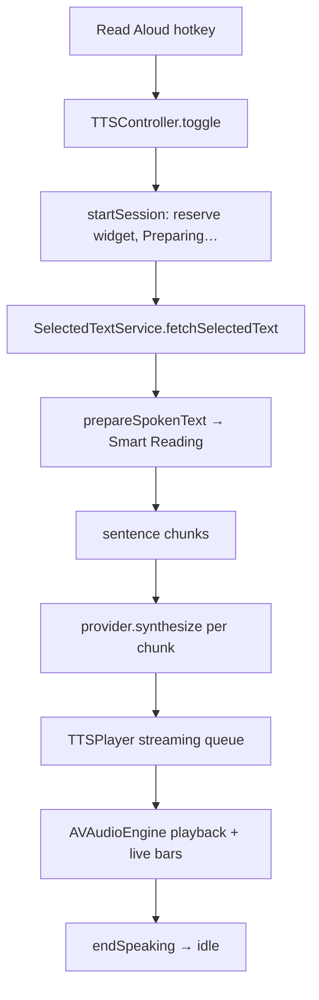

# Zerm Read Aloud

Text-to-speech — the mirror of dictation. Select text anywhere → hotkey → Zerm speaks it (local Kokoro or cloud). Code in `Zerm/TextToSpeech/`.

## Key types

- `TTSController` — orchestrator; owns mutual exclusion with dictation via the single `RecordingState`.
- `TTSProvider` + `TTSProviderRegistry` — provider protocol (mirrors STT `CloudProvider`). Local: Kokoro. Cloud: Deepgram, ElevenLabs, OpenAI, Gemini, Inworld, Cartesia.
- `TTSPlayer` — one `AVAudioEngine`/`AVAudioPlayerNode` pipeline with a **streaming queue** (`startStreaming`/`enqueue`/`finishEnqueueing`).
- `KokoroModelManager` / `KokoroEngine` — on-device download + `sherpa-onnx` synthesis.

## Instant feel

First sentence plays while the rest synthesizes (first chunk = 1 sentence, rest ≈220 chars). Kokoro pre-warmed on launch.

## Shared widget

Reuses the dictation notch/mini widget + live audio bars (TTS output level → `recorder.audioMeter`). Widget label follows `RecordingState`: **Thinking…** (`generatingSpeech`, AI rewrite) → **Preparing…** (`preparingSpeech`, synth) → **bars** (`speaking`). Double-Escape cancels.

## Gotcha (fixed)

Metering tap is installed **once, never removed** in hot paths — `removeTap` from the audio-thread completion handler while `stop()` also removed it deadlocked `AVAudioEngine` and froze the app.

Related: [[Zerm Smart Reading]], [[Zerm On-Device LLM]], [[Zerm Three Model Platform]]
