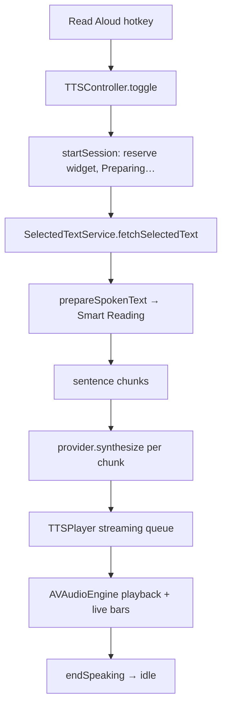

# Zerm Read Aloud

Text-to-speech — the mirror of dictation. Select text anywhere → hotkey → Zerm speaks it (local Kokoro or cloud). Code in `Zerm/TextToSpeech/`.

```mermaid
flowchart TB
    HK[Read Aloud hotkey] --> TC[TTSController.toggle]
    TC --> SESS[startSession: reserve widget, Preparing…]
    SESS --> FETCH[SelectedTextService.fetchSelectedText]
    FETCH --> PREP[prepareSpokenText → Smart Reading]
    PREP --> CHUNK[sentence chunks]
    CHUNK --> SYN[provider.synthesize per chunk]
    SYN --> Q[TTSPlayer streaming queue]
    Q --> PLAY[AVAudioEngine playback + live bars]
    PLAY --> DONE[endSpeaking → idle]
```

## Key types

- `TTSController` — orchestrator; owns mutual exclusion with dictation via the single `RecordingState`.
- `TTSProvider` + `TTSProviderRegistry` — provider protocol (mirrors STT `CloudProvider`). Local: Kokoro. Cloud: Deepgram, ElevenLabs, OpenAI, Gemini, Inworld, Cartesia.
- `TTSPlayer` — one `AVAudioEngine`/`AVAudioPlayerNode` pipeline with a **streaming queue** (`startStreaming`/`enqueue`/`finishEnqueueing`).
- `KokoroModelManager` / `KokoroEngine` — on-device download + `sherpa-onnx` synthesis.

## Instant feel

First sentence plays while the rest synthesizes (first chunk = 1 sentence, rest ≈220 chars). Kokoro pre-warmed on launch.

## Shared widget

Reuses the dictation notch/mini widget + live audio bars (TTS output level → `recorder.audioMeter`). Widget label follows `RecordingState`: **Thinking…** (`generatingSpeech`, AI rewrite) → **Preparing…** (`preparingSpeech`, synth) → **bars** (`speaking`). Double-Escape cancels.

## Meeting coexistence

Dictation remains available during a meeting. Read Aloud is allowed only when `AudioOutputRouteMonitor` confirms a wired, Bluetooth/AirPods or USB headset route. Starting a meeting synchronously stops active Read Aloud on speakers before capture opens. If the safe route disconnects mid-meeting, Read Aloud stops immediately and posts a notification while meeting capture and Dictation continue. The analog output jack is inherently ambiguous, so Settings provides a persisted per-device “treat as speakers” safety override.

## Gotchas (fixed)

- Metering tap is installed **once, never removed** in hot paths — `removeTap` from the audio-thread completion handler while `stop()` also removed it deadlocked `AVAudioEngine` and froze the app.
- **Terminal selection fetch (fixed 2026-07-02).** The `.shortcut` strategy posts a synthetic ⌘C at the HID tap, where the OS merges physically-held modifiers — and the Read Aloud hotkey fires on key-down, so the still-held ⌃⌥ turned the copy into ⌃⌥⌘C (ignored by terminals). SelectedTextKit also polls the pasteboard only 100 ms, too short for embedded terminals/Electron panes. `SelectedTextService` now waits for modifier release (≤1 s) before the strategies run, and falls back to its own ⌘C (private CGEventSource, no modifier merge) with a 600 ms pasteboard poll + restore.

Related: [[Zerm Meeting Recording]], [[Zerm Smart Reading]], [[Zerm On-Device LLM]], [[Zerm Three Model Platform]]
