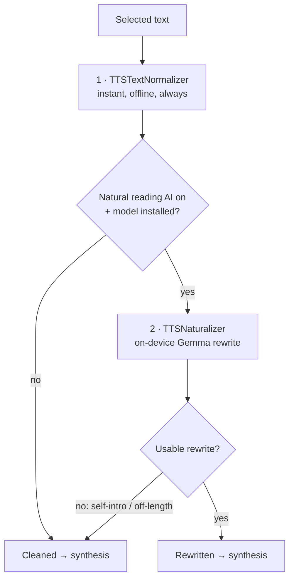

# Zerm Smart Reading

Makes Read Aloud sound human, not robotic. Two layers; order matters. The deterministic normalizer **always runs first**; the AI layer only refines clean text and falls back on failure.

## Layer 1 — `TTSTextNormalizer` (instant, deterministic)

Always on (`TTSSettings.smartCleanup`). Mechanical pass:
- Letter-acronyms spelled (`API`→"A P I"), word-acronyms kept (NASA/JSON).
- URLs/emails/paths spoken; `config.yaml`→"config dot yaml"; `ENOENT`→"file not found".
- `$5`→"5 dollars", `95%`→"95 percent"; snake_case/camelCase split; underscores stripped.
- Emoji: `✅`→"check", `❌`→"no", `⚠️`→"warning"; rest stripped (no "white heavy check mark").
- **Tables flattened first**: `│ a │ b │`→"a, b." (commas=pauses, rows=sentences); borders/separators collapse.
- Markdown + box-drawing removed.

## Layer 2 — `TTSNaturalizer` (optional, on-device AI)

Off by default (`TTSSettings.naturalReadingAI`); needs the [[Zerm On-Device LLM]]. Rewrites cleaned text into natural prose. Small-model scaffolding:
- **Imperative completion prompt** (`TEXT:`…`REWRITTEN:`), not "You are…" (which makes small models self-introduce).
- One-shot example anchors format.
- `isUsableRewrite` validation rejects self-intros/refusals/off-length → fall back to cleaned text.
- Temp 0.3.

## Settings

Read Aloud settings → **Smart reading** section: both toggles + the on-device model card. Same model/card also on the AI Models screen (for enhancement).

Related: [[Zerm Read Aloud]], [[Zerm On-Device LLM]], [[Zerm Three Model Platform]]
