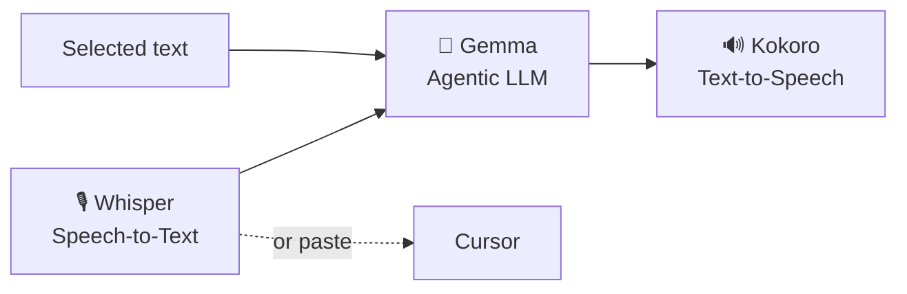

# Zerm Three Model Platform

Zerm's defining architecture: the experience is powered by **three on-device AI models**, each owned and installed by the app, each able to run fully offline.

The middle model (**Gemma**) is the agentic layer serving *both* sides: it cleans speech-to-text output for accuracy and de-robotizes text-to-speech.

| | STT | TTS | LLM |
|---|---|---|---|
| Default | Whisper (ggml) | Kokoro-82M | Gemma 4 E2B Q4_K_M |
| Engine | `whisper.cpp` | `sherpa-onnx` | `llama.cpp` |
| ~Size | 150 MB–3 GB | ~330 MB | ~3.1 GB |
| Manager | `WhisperModelManager` | `KokoroModelManager` | `LocalLLMModelManager` |
| Path | `…/WhisperModels/` | `…/TTSModels/` | `…/LLMModels/` |

All live under `~/Library/Application Support/com.arcusis.zerm/` (outside the bundle → survive reinstalls). Every model uses the same download UX (manager classes are mirrors); cloud providers remain optional per task.

Related: [[Zerm Read Aloud]], [[Zerm On-Device LLM]], [[Zerm Smart Reading]], [[Zerm Architecture]]
