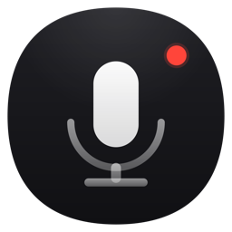

<div align="center">
  
  <h1>Zerm for macOS</h1>
  <p>Native macOS voice dictation, transcription, context-aware prompting, and auto-paste.</p>

  [](../LICENSE)
  
  [](https://github.com/arcusis/Zerm/releases)
</div>

---

Zerm is the native macOS application in this repository. It records your voice,
transcribes it, optionally enhances the result, and can paste the final text
directly into the focused app.

## Upstream Attribution

Zerm is based on [VoiceInk](https://github.com/Beingpax/VoiceInk) by
[Beingpax](https://github.com/Beingpax). VoiceInk provided the original
foundation for the macOS dictation experience, transcription pipeline, Power
Mode concept, model handling, and related app services.

Zerm is a modified GPLv3 derivative. This directory keeps the GPLv3 license,
preserves attribution to VoiceInk, and documents the project relationship in
[../NOTICE](../NOTICE).

## Features

- Fast global dictation workflow for macOS.
- Configurable shortcuts and push-to-talk behavior.
- Auto-stop and auto-paste support.
- Power Mode for app, website, and workflow-specific prompts.
- Local transcription paths using Whisper and FluidAudio-backed models.
- Optional cloud transcription providers when configured by the user.
- AI enhancement prompts for cleanup, rewriting, assistant use, and custom modes.
- Personal dictionary, vocabulary, and word replacements.
- Audio-file transcription and transcript history.
- macOS permission onboarding for microphone, Accessibility, and context features.

## Requirements

- macOS 14.4 or later
- Xcode 16 or later for development
- Microphone permission for recording
- Accessibility permission for auto-paste and global insertion
- Screen Recording permission when context-aware screen features are used

## Build From Source

```sh
xcodebuild \
  -project Zerm.xcodeproj \
  -scheme Zerm \
  -configuration Debug \
  CODE_SIGNING_ALLOWED=NO \
  build
```

For detailed build and signing notes, see [BUILDING.md](BUILDING.md).

## Contributing

Issues and pull requests are welcome when they are aligned with the macOS app.

Before opening a PR:

1. Keep changes focused.
2. Preserve GPLv3 attribution for VoiceInk-derived code.
3. Include screenshots or recordings for UI changes.
4. Note permission, signing, or notarization behavior that affects testing.

See [CONTRIBUTING.md](CONTRIBUTING.md) for more detail.

## License

Zerm is licensed under the [GNU General Public License v3.0](../LICENSE).

Original VoiceInk work is credited to Beingpax / Pax. Zerm-specific
modifications are maintained by Arcusis.
